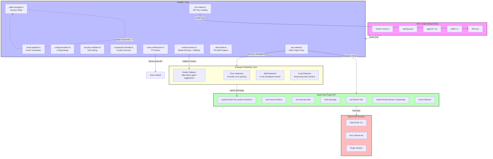

# Architecture

The PAI-OpenCode Adapter is a **plugin adapter layer**, not a fork. It sits between [PAI v4.0.3](https://github.com/danielmiessler/Personal_AI_Infrastructure) content (hooks, settings, agents) and the OpenCode plugin API, translating events and configurations so your PAI workflows run unchanged on OpenCode.

## System Diagram

## Sub-systems

| Sub-system | File | Responsibility |
|------------|------|----------------|
| Event Adapter | `src/adapters/event-adapter.ts` | PAI → OpenCode event translation |
| Config Translator | `src/adapters/config-translator.ts` | `settings.json` → `opencode.json` |
| State Manager | `src/lib/state-manager.ts` | Session-scoped `Map<sessionId, T>` |
| Security Validator | `src/handlers/security-validator.ts` | Tool gating, input sanitization |
| Compaction Handler | `src/handlers/compaction-handler.ts` | Proactive + reactive compaction |
| Voice Notifications | `src/handlers/voice-notifications.ts` | ElevenLabs TTS, ntfy, Discord |

## Subagent Reliability Suite

| Layer | Location | Responsibility |
|-------|----------|----------------|
| Error Detection | `src/plugin/pai-unified.ts` | Parses Task output for provider errors (rate limit, model not found, auth failure) |
| Model Fallback | `src/lib/model-resolver.ts` + `pai-unified.ts` | Suggests alternative `subagent_type` with models from fallback chain |
| Stall Detection | `src/plugin/pai-unified.ts` | 3-minute heartbeat monitor per subagent; warns primary on inactivity |
| Loop Detection | `src/plugin/pai-unified.ts` | Hashes reasoning chunks in rolling window of 8; detects 3+ repeats |

All layers are fail-open — they inject guidance via `<system-reminder>` in system prompts but never block execution or crash the host process.

## Additional Components

| Component | File | Purpose |
|-----------|------|---------|
| Dedup Cache | `src/core/dedup-cache.ts` | 5s TTL message deduplication |
| Event Bus | `src/core/event-bus.ts` | Internal event pub/sub |
| File Logger | `src/lib/file-logger.ts` | `/tmp/pai-opencode-debug.log` |
| Model Resolver | `src/lib/model-resolver.ts` | Per-role model routing with fallback chains |
| Env Loader | `src/lib/env-loader.ts` | Auto-loads API keys from `~/.config/PAI/.env` for skills |
| Skill Loader | `src/lib/skill-loader.ts` | Native OpenCode skill tool support |
| Agent Model Sync | `src/plugin/pai-unified.ts` | Syncs `model:` field in agent `.md` from `pai-adapter.json` on startup |
| StatusLine | `src/statusline/statusline.sh` | tmux status-right integration |
| Self-Updater | `src/updater/self-updater.ts` | Monitors PAI + OC for updates |
| CLI Shim | `src/adapters/cli-shim.sh` | `claude` → `opencode` wrapper |

## Design Principles

- **No Anthropic subscription required** — Use any LLM provider via OpenCode
- **Adapter pattern** — Wraps PAI content, never modifies it
- **Zero forks** — Upgrades are diffs, not merges
- **Read-only PAI** — Your `~/.claude/` directory remains untouched
- **Session-scoped state** — No global variables, safe concurrent sessions
- **File-based logging** — Never corrupts OpenCode TUI with console.log
- **Fail-open reliability** — Subagent monitors inject guidance but never block

---

[← Back to README](../README.md) · [Architecture Decision Records](adrs/)
